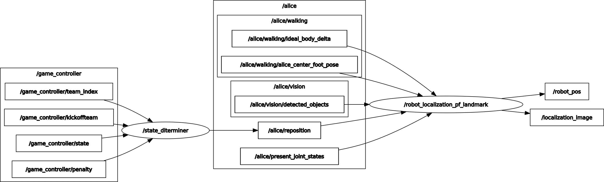

# Humanoid RobotLocalization
Humanoid application of Monte Carlo Localization Algorithm using designated keypoints on the soccer field



## 1. Prerequisite
### 1.1 **Ubuntu** and **ROS**
Ubuntu 64-bit 18.04 or 20.04. \
ROS Melodic or Noetic. [ROS Installation](http://wiki.ros.org/ROS/Installation)
### 1.2 OpenCV
Follow [OpenCV Installation](https://docs.opencv.org/4.5.0/d7/d9f/tutorial_linux_install.html)
### 1.3 Others
```
git clone https://github.com/RobotWebTools/mjpeg_server
sudo apt-get install -y libyaml-cpp-dev
sudo apt-get install -y libeigen3-dev
```

## 2. How to use
### 2.1 Run / Launch nodes
```
## Detection 
roslaunch zed_wrapper zed.launch
roslaunch darknet_ros darknet_ros.launch
rosrun alice_vision alice_vision_node

## Robot Localization
rosrun robot_localization_pf_landmarks robot_localization_pf_landmarks

## Web streaming
rosrun mjpeg_server mjpeg_server _port:=8080
http://[network ip]:8080/stream?topic=/robot_localization/localization_image
```
<!-- ### 2.1.2 Launch nodes -->
```
## or just Launch parameterized launch file 
roslaunch robot_localization_pf_landmarks robot_localization.launch mode:=kinematics/PF gui_mode:=on/off/nuc
```

### 2.2 Initialize start / restart position
```
rostopic pub /alice/reposition geometry_msgs/Pose2D {"x: 5.2, y : 3.7, theta : 0.0"}
```

## 3. Data to Record
```
## Input data
rosbag record -O [filename].bag /alice/ideal_body_delta /alice/vision/detected_objects \
                                /heroehs/alice_center_foot_pose /robotis/present_joint_states
## Output data
rosbag record -O [filename].bag /alice/robot_pos
```